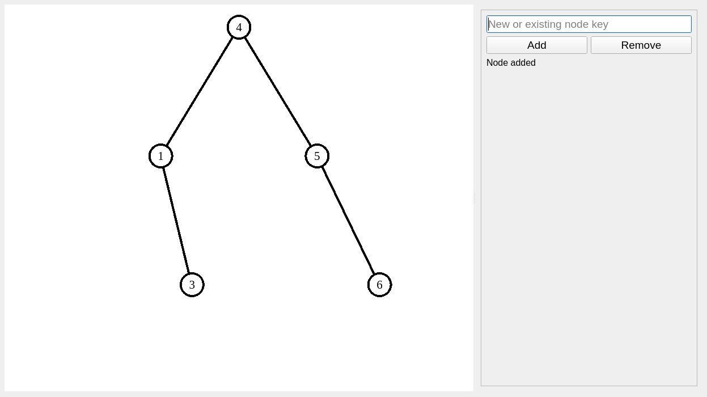

# 2-3 tree

This repository contains the sources of a simple 2-3 tree implementation
written in C++ and Qt.

* `src/2-3_tree_impl/` contains a STL container implementing 2-3 tree
* `src/gui/` contains a simple tree editor

## Screenshot

